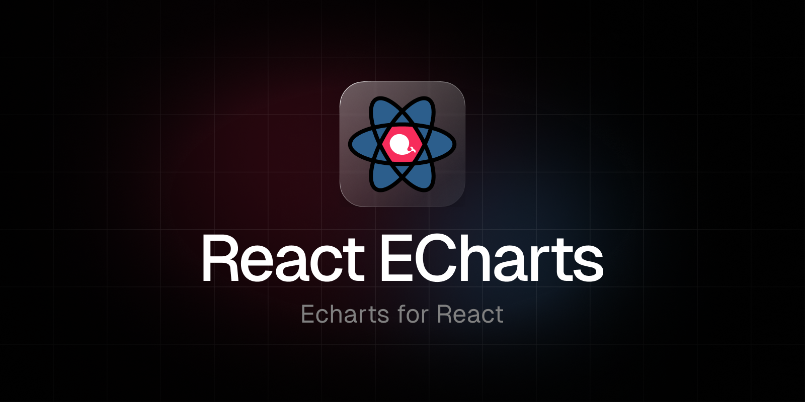

<br />

<div align="center">

[](https://www.npmjs.com/package/@kbox-labs/react-echarts)
[](https://www.npmjs.com/package/@kbox-labs/react-echarts)
[](https://bundlephobia.com/result?p=@kbox-labs/react-echarts)
[](https://github.com/kbox-labs/react-echarts/actions/workflows/release.yml)
[](https://coveralls.io/github/kbox-labs/react-echarts)
[](https://www.typescriptlang.org)
[](https://www.npmjs.com/package/@kbox-labs/react-echarts)

</div>

<div align="center">
  <b>ECharts for React</b>
</div>

## Introduction

[ECharts](https://echarts.apache.org/en/index.html) is is an incredible open-source library that empowers users with robust charting and visualization capabilities. It provides a seamless experience with its intuitive, interactive, and highly customizable charts.

While there are existing wrappers for ECharts in the React ecosystem, we noticed a lack of implementations that truly embraced the core concepts of React. Hence, our primary goal was to create a user-friendly React component that effortlessly exposes the vast range of ECharts functionalities through props. By doing so, we aimed to simplify the process of utilizing ECharts within a React project while ensuring flexibility and ease of use.

## Installation

In order to use **`react-echarts`**, all you need to do is install the npm package:

```sh
yarn add @kbox-labs/react-echarts
```

> **`echarts`** and **`react`** are **peerDependencies** of **`react-echarts`**, you may **install your own versions**.

## Usage

### `<EChart />`

To start using `react-echarts`, you just need to import the **`<EChart />`** component from the root folder. Check the [props](#props) section out for more info:

```js
import { EChart } from '@kbox-labs/react-echarts'

function MyChart() {
  return (
    <EChart
      className={'my-classname'}
      xAxis={{
        type: 'category'
      }}
      yAxis={{
        type: 'value',
        boundaryGap: [0, '30%']
      }}
      series={[
        {
          type: 'line',
          data: [
            ['2022-10-12', 750],
            ['2022-10-17', 300],
            ['2022-10-18', 100]
          ]
        }
      ]}
    />
  )
}
```

### `useEcharts`

In case you need to have more control over the container being used by the library to render ECharts, a special hook ```useECharts``` is provided.

```js
export const EChart: FC<EChartProps> = (props) => {
  const containerRef: Ref<HTMLDivElement> = useRef()

  useECharts({ containerRef, ...props })

  return (
    <div
      ref={containerRef}
      id={id}
    />
  )
}
```

## Props

While some props have been provided to facilitate specific use cases, most of them follow the [Apache ECharts option schema](https://echarts.apache.org/next/en/option.html). The following props, grouped by category, are available:

### General

| Prop                        |     Type     | Description                                                                 |             Default              |
| :-------------------------- | :----------: | --------------------------------------------------------------------------- | :------------------------------: |
| **`id`**                    |  `{String}`  | id of the container                                                         |                ''                |
| **`className`**             |  `{String}`  | Classname of the container                                                  |                ''                |
| **`style`**                 |  `{Object}`  | Style object applied to the container                                       |               null               |

### ECharts

| Prop             |    Type     | Description                                                                                  | Default |
| :--------------- | :---------: | -------------------------------------------------------------------------------------------- | :-----: |
| **`notMerge`**   | `{Boolean}` | Whether or not to merge with previous option                                                 |  false  |
| **`lazyUpdate`** | `{Boolean}` | Whether or not to update chart immediately;                                                  |  false  |
| **`theme`**      | `{String}`  | Theme to be applied. This can be a configuring object of a theme, or a theme name registered |   ''    |
| **`group`**      | `{String}`  | Group name to be used in chart connection.                                                   |   ''    |
| **`renderer`**   | `{String}`  | Supports 'canvas' or 'svg'                                                                   |  'svg'  |

### Option keys props

| Prop                          |    Type    | Description                                                      | Default |
| :---------------------------- | :--------: | ---------------------------------------------------------------- | :-----: |
| **`title`**                   | `{Object}` | <https://echarts.apache.org/option.html#title>                   |  null   |
| **`legend`**                  | `{Object}` | <https://echarts.apache.org/option.html#legend>                  |  null   |
| **`grid`**                    | `{Object}` | <https://echarts.apache.org/option.html#grid>                    |  null   |
| **`xAxis`**                   | `{Object}` | <https://echarts.apache.org/option.html#xAxis>                   |  null   |
| **`yAxis`**                   | `{Object}` | <https://echarts.apache.org/option.html#yAxis>                   |  null   |
| **`polar`**                   | `{Object}` | <https://echarts.apache.org/option.html#polar>                   |  null   |
| **`radiusAxis`**              | `{Object}` | <https://echarts.apache.org/option.html#radiusAxis>              |  null   |
| **`angleAxis`**               | `{Object}` | <https://echarts.apache.org/option.html#angleAxis>               |  null   |
| **`radar`**                   | `{Object}` | <https://echarts.apache.org/option.html#radar>                   |  null   |
| **`dataZoom`**                | `{Object}` | <https://echarts.apache.org/option.html#dataZoom>                |  null   |
| **`visualMap`**               | `{Object}` | <https://echarts.apache.org/option.html#visualMap>               |  null   |
| **`tooltip`**                 | `{Object}` | <https://echarts.apache.org/option.html#tooltip>                 |  null   |
| **`brush`**                   | `{Object}` | <https://echarts.apache.org/option.html#brush>                   |  null   |
| **`geo`**                     | `{Object}` | <https://echarts.apache.org/option.html#geo>                     |  null   |
| **`parallel`**                | `{Object}` | <https://echarts.apache.org/option.html#parallel>                |  null   |
| **`parallelAxis`**            | `{Object}` | <https://echarts.apache.org/option.html#parallelAxis>            |  null   |
| **`singleAxis`**              | `{Object}` | <https://echarts.apache.org/option.html#singleAxis>              |  null   |
| **`timeline`**                | `{Object}` | <https://echarts.apache.org/option.html#timeline>                |  null   |
| **`graphic`**                 | `{Object}` | <https://echarts.apache.org/option.html#graphic>                 |  null   |
| **`calendar`**                | `{Object}` | <https://echarts.apache.org/option.html#calendar>                |  null   |
| **`dataset`**                 | `{Object}` | <https://echarts.apache.org/option.html#dataset>                 |  null   |
| **`aria`**                    | `{Object}` | <https://echarts.apache.org/option.html#aria>                    |  null   |
| **`series`**                  | `{Object}` | <https://echarts.apache.org/option.html#series>                  |  null   |
| **`color`**                   | `{Object}` | <https://echarts.apache.org/option.html#color>                   |  null   |
| **`backgroundColor`**         | `{Object}` | <https://echarts.apache.org/option.html#backgroundColor>         |  null   |
| **`textStyle`**               | `{Object}` | <https://echarts.apache.org/option.html#textStyle>               |  null   |
| **`animation`**               | `{Object}` | <https://echarts.apache.org/option.html#animation>               |  null   |
| **`animationThreshold`**      | `{Object}` | <https://echarts.apache.org/option.html#animationThreshold>      |  null   |
| **`animationDuration`**       | `{Object}` | <https://echarts.apache.org/option.html#animationDuration>       |  null   |
| **`animationEasing`**         | `{Object}` | <https://echarts.apache.org/option.html#animationEasing>         |  null   |
| **`animationDelay`**          | `{Object}` | <https://echarts.apache.org/option.html#animationDelay>          |  null   |
| **`animationDurationUpdate`** | `{Object}` | <https://echarts.apache.org/option.html#animationDurationUpdate> |  null   |
| **`blendMode`**               | `{Object}` | <https://echarts.apache.org/option.html#blendMode>               |  null   |
| **`hoverLayerThreshold`**     | `{Object}` | <https://echarts.apache.org/option.html#hoverLayerThreshold>     |  null   |
| **`useUTC`**                  | `{Object}` | <https://echarts.apache.org/option.html#useUTC>                  |  null   |
| **`media`**                   | `{Object}` | <https://echarts.apache.org/option.html#media>                   |  null   |

> For more detailed info, check the [ECharts docs](https://echarts.apache.org/option.html)

### Events

| Prop                         |     Type     | Description                                                                                                 | Default |
| :--------------------------- | :----------: | ----------------------------------------------------------------------------------------------------------- | :-----: |
| **`onMount`**                | `{Function}` | Callback to be called on first component mount.                                                             |  null   |
| **`onUpdate`**               | `{Function}` | Callback to be called whenever the component is updated.                                                    |  null   |
| **`onUnmmount`**             | `{Function}` | Callback to be called when the component is unmounted.                                                      |  null   |
| **`onRendered`**             | `{Function}` | Trigger when a frame rendered. Notice that the rendered event does not indicate that the animation finished |  null   |
| **`onFinished`**             | `{Function}` | Triggered when render finished, that is, when animation finished                                            |  null   |
| **`onClick`**                | `{Function}` | Event of chart click.                                                                                       |  null   |
| **`onDoubleClick`**          | `{Function}` | Event of double chart click.                                                                                |  null   |
| **`onMouseDown`**            | `{Function}` | Event of mouse down chart                                                                                   |  null   |
| **`onMouseMove`**            | `{Function}` | Event of mouse mouse chart                                                                                  |  null   |
| **`onMouseUp`**              | `{Function}` | Event of mouse up chart                                                                                     |  null   |
| **`onMouseOver`**            | `{Function}` | Event of mouse over chart                                                                                   |  null   |
| **`onMouseOut`**             | `{Function}` | Event of global out chart                                                                                   |  null   |
| **`onGlobalOut`**            | `{Function}` | Event of global out chart                                                                                   |  null   |
| **`onContextMenu`**          | `{Function}` | Event of context menu                                                                                       |  null   |
| **`onHighlight`**            | `{Function}` | Event of data highlight.                                                                                    |  null   |
| **`onDownplay`.**            | `{Function}` | Event of data downplay.                                                                                     |  null   |
| **`onSelectChanged`**        | `{Function}` | Event emitted when data selection is changed.                                                               |  null   |
| **`onLegendSelectChanged`**  | `{Function}` | Event emitted after legend selecting state changes.                                                         |  null   |
| **`onLegendSelected`**       | `{Function}` | Event emitted after legend is selected.                                                                     |  null   |
| **`onLegendUnselected`**     | `{Function}` | Event emitted after unselecting legend.                                                                     |  null   |
| **`onLegendSelectAll`**      | `{Function}` | Event emitted after all legends are selected.                                                               |  null   |
| **`onLegendInverseSelect`**  | `{Function}` | Event emitted after inversing all legends.                                                                  |  null   |
| **`onLegendScroll`**         | `{Function}` | Event when trigger legend scroll.                                                                           |  null   |
| **`onDataZoom`**             | `{Function}` | Event emitted after zooming data area.                                                                      |  null   |
| **`onDataRangeSelected`**    | `{Function}` | Event emitted after range is changed in visualMap.                                                          |  null   |
| **`onTimelineChanged`**      | `{Function}` | Event emitted after time point in timeline is changed.                                                      |  null   |
| **`onTimelinePlayChanged`**  | `{Function}` | Switching event of play state in timeline.                                                                  |  null   |
| **`onRestore`**              | `{Function}` | Resets option event.                                                                                        |  null   |
| **`onDataViewChanged`**      | `{Function}` | Changing event of data view tool in toolbox.                                                                |  null   |
| **`onMagicTypeChanged`**     | `{Function}` | Switching event of magic type tool in toolbox.                                                              |  null   |
| **`onGeoSelectChanged`**     | `{Function}` | Event emitted after selecting state changes.                                                                |  null   |
| **`onGeoSelected`**          | `{Function}` | Event after selecting.                                                                                      |  null   |
| **`onGeoUnselected`**        | `{Function}` | Cancels selected event.                                                                                     |  null   |
| **`onAxisAreaSelected`**     | `{Function}` | Selecting event of range of parallel axis.                                                                  |  null   |
| **`onFocusNodeadJacency`**   | `{Function}` | Adjacent nodes highlight event in graph.                                                                    |  null   |
| **`onUnfocusNodeAdjacency`** | `{Function}` | Adjacent nodes reverse-highlight event in graph.                                                            |  null   |
| **`onBrush`**                | `{Function}` | Event triggered after action brush dispatched.                                                              |  null   |
| **`onBrushEnd`**             | `{Function}` | Event triggered after action brushEnd dispatched.                                                           |  null   |
| **`onBrushSelected`**        | `{Function}` | Notice what are selected.                                                                                   |  null   |
| **`onGlobalCursorTaken`**    | `{Function}` | -                                                                                                           |  null   |

## Community

The **Kbox Labs** community can be found on [GitHub Discussions](https://github.com/orgs/kbox-labs/discussions), where you can ask questions, voice ideas, and share your projects.

Our [Code of Conduct](https://github.com/kbox-labs/react-echarts/blob/master/CODE_OF_CONDUCT.md) applies to all **Kbox Labs** community channels.

## Contributing

Please see our [contributing.md](/contributing.md).

### Good First Issues

We have a list of [good first issues](https://github.com/koi18n/koi18n/labels/good%20first%20issue) that contain bugs that have a relatively limited scope. This is a great place to get started, gain experience, and get familiar with our contribution process.

## Authors

- Hugo Corta ([@hugocxl](https://github.com/hugocxl))

## License

MIT License © 2023-Present [Hugo Corta](https://github.com/hugocxl)
