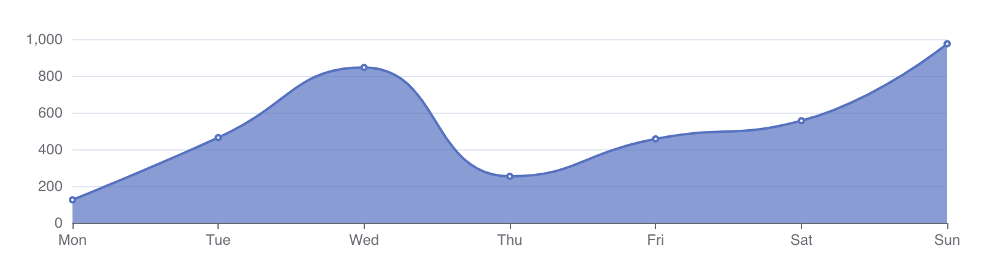

# react-echarts

<div align="center">
  

[](https://www.npmjs.com/package/@hcorta/react-echarts)
[](https://bundlephobia.com/result?p=@hcorta/react-echarts)
[](https://github.com/apache/incubator-echarts)
[](https://david-dm.org/hcorta/react-echarts)
[](https://www.npmjs.com/package/@hcorta/react-echarts)

<p>A <strong>simple</strong> and <strong>declarative</strong> set of powerful React components built on top of <strong><a href="https://echarts.apache.org/en/index.html">Apache ECharts</a></strong></p>

</div>

---

## Features

- **16** chart types
- **SVG** Rendering
- **Free**
- **Lightweight**
- Highly **customizable**
- **Themes**
- **Interactive**
- **Responsive** design

## Installation

In order to use **`react-echarts`**, all you need to do is install the npm package:

```sh
yarn add @hcorta/react-echarts
```

---

## ⭐️ Sponsoring

I do this open source work in my free time. If you use **`react-echarts`** for an important work, and you'd like me to invest more time on it, you may [buy me a coffee](https://www.buymeacoffee.com/hcorta). Thanks! ☺️

---

## Introduction

[Apache ECharts](https://echarts.apache.org/en/index.html) is a free, powerful charting and visualization library offering intuitive, interactive, and highly customizable charts. It is written in pure **JavaScript** and based on **zrender**, a canvas library.

**`react-echarts`** is an abstraction library built with [React](https://facebook.github.io/react/) on top of ECharts. It exposes a set of components for developers that can be combined to set up amazing charts in their web pages. Main principles of **`react-echarts`** are:

1. **Simplicty:** **`react-echarts`** makes it easy to generate ECharts components by wrapping the code required to render the entire chart.
2. **Declarative**: components are purely presentational.
3. **Easy to customize**: In most cases, charts look and behave exactly as you need without modifications. A simple options-structure allows for deep customization, and styling can be done via JavaScript or CSS.

## Usage

While some props have been provided to facilitate specific use cases (single series mostly), most of them follow the [ECharts option schema](https://echarts.apache.org/next/en/option.html#title), throught an option-key-like prop declaration.

- **Quick start example:** Check out the [live demo](https://codesandbox.io/s/react-echarts-simple-area-umnfw)

```jsx
import { AreaChart } from '@hcorta/react-echarts'

function App() {
  return (
    <AreaChart
      smooth
      data={[125, 464, 846, 253, 457, 556, 975]}
      xAxis={['Mon', 'Tue', 'Wed', 'Thu', 'Fri', 'Sat', 'Sun']}
    />
  )
}
```



For other examples and components, check out the [documentation](hcorta.github.io/react-echarts/).

## Charts

The library exports the following React components:

- Chart
- AreaChart
- BarChart
- ColumnChart
- DoughnutChart
- FunnelChart
- HeatmapChart
- LineChart
- MapChart
- PieChart
- RadarChart
- SankeyChart
- ScatterChart
- SunburstChart
- TreeChart
- TreeMapChart

```jsx
import {
  LineChart,
  AreaChart,
  BarChart,
  ColumnChart,
  PieChart,
  DonutChart
} from '@hcorta/react-echarts'
```

## Hooks

### **`useEcharts`**

Useful when you need, for example, to connect charts or register a new theme, it returns those methods provided by the ECharts core library:

```jsx
import { useEcharts } from '@hcorta/react-echarts'

const {
  connect,
  disconnect,
  registerMap,
  registerTheme,
  registerAction,
  registerCoordinateSystem,
  getInstanceByDom,
  getInstanceById,
  getMap
} = useEcharts()
```

| Method                 | Description                                       | Parameters                                                       |
| :--------------------- | ------------------------------------------------- | :--------------------------------------------------------------- |
| **`connect`**          | Connects interaction of multiple chart series.    | `(group: string or Array)` Group id, or array of chart instance. |
| **`disconnect`**       | Disconnects interaction of multiple chart series. | `(group: string)` Group id.                                      |
| **`getInstanceByDom`** | Returns chart instance of dom container.          | `(target: HTMLDivElement or HTMLCanvasElement) => ECharts`       |
| **`getInstanceById`**  | Returns chart instance of id passed.              | `(id: string) => ECharts`                                        |
| **`getMap`**           | Get a registered map.                             | `(mapName: string) => {Object}`                                  |
| **`registerMap`**      | Registers available maps.                         | `(mapName: string, geoJson: {Object}, specialAreas?: {Object}`   |
| **`registerTheme`**    | Registers a theme.                                | `(themeName: string, theme: {Object})`                           |
| **`registerAction`**   | Registers an action.                              | `(actionName: string, callback: {Function})`                     |

A simple use case would look like this:

```jsx
import { useEffect } from 'react'
import { useEcharts, AreaChart } from '@hcorta/react-echarts'

export default function App() {
  const { connect, registerTheme } = useEcharts()
  const commonChartProps = {
    xAxis: ['Big', 'Medium', 'Small'],
    tooltip: { show: true },
    group: 'clothes'
  }

  useEffect(() => {
    connect('clothes')
    registerTheme('andromeda', andromedaThemeObject)
  }, [])

  return (
    <div className="App">
      <AreaChart {...commonChartProps} theme={'andromeda'} data={[2, 5, 8]} />
      <AreaChart {...commonChartProps} data={[5, 9, 1]} />
    </div>
  )
}
```

## Components Props

The following props, grouped by category, are available for all components exported by the library.

<br>

### Common

| Prop              |          Type          | Description                                                                 | Default |
| :---------------- | :--------------------: | --------------------------------------------------------------------------- | :-----: |
| **`style`**       |       `{Object}`       | Styles object applied to the container                                      |  null   |
| **`className`**   |       `{String}`       | Classname of the container                                                  |   ''    |
| **`height`**      | `{Number} or {String}` | Height of the chart                                                         |   280   |
| **`width`**       | `{Number} or {String}` | Width of the chart                                                          | '100%'  |
| **`getInstance`** |      `{Function}`      | Callback called on mount that returns the ECharts instance of the component |  null   |
| **`getRef`**      |      `{Function}`      | Get the div container ref after mount                                       |  null   |

<br>

### State

| Prop               |     Type     | Description                                                                                                          |   Default    |
| :----------------- | :----------: | -------------------------------------------------------------------------------------------------------------------- | :----------: |
| **`shouldUpdate`** | `{Function}` | Callback to control whether the component should update or not. Custom `shouldComponentUpdate` method.               | `() => true` |
| **`isLoading`**    | `{Boolean}`  | Whether the component is loading. When is set to true, it will display the loading component.                        |    false     |
| **`isMounting`**   | `{Boolean}`  | Whether the component is mounting. When is set to true, it will display the skeleton commponent instead of the chart |    false     |

<br>

### Custom Components

| Prop                    |     Type      | Description                              |    Default    |
| :---------------------- | :-----------: | ---------------------------------------- | :-----------: |
| **`loadingComponent`**  | `{Component}` | Custom loading component                 | `<Loading/>`  |
| **`loadingProps`**      |  `{Object}`   | Props spreaded to the loading component  |      {}       |
| **`skeletonComponent`** | `{Component}` | Custom skeleton component                | `<Skeleton/>` |
| **`skeletonProps`**     |  `{Object}`   | Props spreaded to the skeleton component |      {}       |

<br>

### ECharts

| Prop             |     Type      | Description                                                                                  | Default |
| :--------------- | :-----------: | -------------------------------------------------------------------------------------------- | :-----: |
| **`option`**     |  `{Object}`   | The ECharts option config, can see https://echarts.apache.org/option.html#title.             |  null   |
| **`notMerge`**   |  `{Boolean}`  | Whether or not to merge with previous option                                                 |  false  |
| **`lazyUpdate`** | `{Component}` | Whether or not to update chart immediately;                                                  |  false  |
| **`silent`**     | `{Component}` | states whether not to prevent triggering events when calling setOption                       |  false  |
| **`theme`**      | `{Component}` | Theme to be applied. This can be a configuring object of a theme, or a theme name registered |  false  |
| **`group`**      | `{Component}` | Group name to be used in chart connection.                                                   |  false  |
| **`renderer`**   | `{Component}` | Supports 'canvas' or 'svg'                                                                   |  false  |

- Special note on `option`: In case it is passed down to the component, the rest of option-like props will be ommited (e.g: xAxis prop). This prop only works on the `<Chart/>` component.

<br>

### Events

| Prop                         |     Type     | Description                                                                                                 | Default |
| :--------------------------- | :----------: | ----------------------------------------------------------------------------------------------------------- | :-----: |
| **`onMount`**                | `{Function}` | Callback to be called on first component mount.                                                             |  null   |
| **`onUpdate`**               | `{Function}` | Callback to be called whenever the component is updated.                                                    |  null   |
| **`onUnmmount`**             | `{Function}` | Callback to be called when the component is unmounted.                                                      |  null   |
| **`onRendered`**             | `{Function}` | Trigger when a frame rendered. Notice that the rendered event does not indicate that the animation finished |  null   |
| **`onFinished`**             | `{Function}` | Triggered when render finished, that is, when animation finished                                            |  null   |
| **`onClick`**                | `{Function}` | Event of chart click.                                                                                       |  null   |
| **`onDoubleClick`**          | `{Function}` | Event of double chart click.                                                                                |  null   |
| **`onMouseDown`**            | `{Function}` | Event of mouse down chart                                                                                   |  null   |
| **`onMouseMove`**            | `{Function}` | Event of mouse mouse chart                                                                                  |  null   |
| **`onMouseUp`**              | `{Function}` | Event of mouse up chart                                                                                     |  null   |
| **`onMouseOver`**            | `{Function}` | Event of mouse over chart                                                                                   |  null   |
| **`onMouseOut`**             | `{Function}` | Event of global out chart                                                                                   |  null   |
| **`onGlobalOut`**            | `{Function}` | Event of global out chart                                                                                   |  null   |
| **`onContextMenu`**          | `{Function}` | Event of context menu                                                                                       |  null   |
| **`onHighlight`**            | `{Function}` | Event of data highlight.                                                                                    |  null   |
| **`onDownplay`.**            | `{Function}` | Event of data downplay.                                                                                     |  null   |
| **`onSelectChanged`**        | `{Function}` | Event emitted when data selection is changed.                                                               |  null   |
| **`onLegendSelectChanged`**  | `{Function}` | Event emitted after legend selecting state changes.                                                         |  null   |
| **`onLegendSelected`**       | `{Function}` | Event emitted after legend is selected.                                                                     |  null   |
| **`onLegendUnselected`**     | `{Function}` | Event emitted after unselecting legend.                                                                     |  null   |
| **`onLegendSelectAll`**      | `{Function}` | Event emitted after all legends are selected.                                                               |  null   |
| **`onLegendInverseSelect`**  | `{Function}` | Event emitted after inversing all legends.                                                                  |  null   |
| **`onLegendScroll`**         | `{Function}` | Event when trigger legend scroll.                                                                           |  null   |
| **`onDataZoom`**             | `{Function}` | Event emitted after zooming data area.                                                                      |  null   |
| **`onDataRangeSelected`**    | `{Function}` | Event emitted after range is changed in visualMap.                                                          |  null   |
| **`onTimelineChanged`**      | `{Function}` | Event emitted after time point in timeline is changed.                                                      |  null   |
| **`onTimelinePlayChanged`**  | `{Function}` | Switching event of play state in timeline.                                                                  |  null   |
| **`onRestore`**              | `{Function}` | Resets option event.                                                                                        |  null   |
| **`onDataViewChanged`**      | `{Function}` | Changing event of data view tool in toolbox.                                                                |  null   |
| **`onMagicTypeChanged`**     | `{Function}` | Switching event of magic type tool in toolbox.                                                              |  null   |
| **`onGeoSelectChanged`**     | `{Function}` | Event emitted after selecting state changes.                                                                |  null   |
| **`onGeoSelected`**          | `{Function}` | Event after selecting.                                                                                      |  null   |
| **`onGeoUnselected`**        | `{Function}` | Cancels selected event.                                                                                     |  null   |
| **`onAxisAreaSelected`**     | `{Function}` | Selecting event of range of parallel axis.                                                                  |  null   |
| **`onFocusNodeadJacency`**   | `{Function}` | Adjacent nodes highlight event in graph.                                                                    |  null   |
| **`onUnfocusNodeAdjacency`** | `{Function}` | Adjacent nodes reverse-highlight event in graph.                                                            |  null   |
| **`onBrush`**                | `{Function}` | Event triggered after action brush dispatched.                                                              |  null   |
| **`onBrushEnd`**             | `{Function}` | Event triggered after action brushEnd dispatched.                                                           |  null   |
| **`onBrushSelected`**        | `{Function}` | Notice what are selected.                                                                                   |  null   |
| **`onGlobalCursorTaken`**    | `{Function}` | -                                                                                                           |  null   |

## Contributing

No one’s perfect. If you’ve found any errors, want to suggest enhancements, or expand on a topic, please feel free to open an Issue or collaborate by PR.

## Code of Conduct

[Contributor Code of Conduct](public/docs/CODE_OF_CONDUCT.md). By participating in this project you agree to abide by its terms.

## License

**react-echarts** is open source software licensed as MIT © [Hugo Corta](https://github.com/hcorta).
